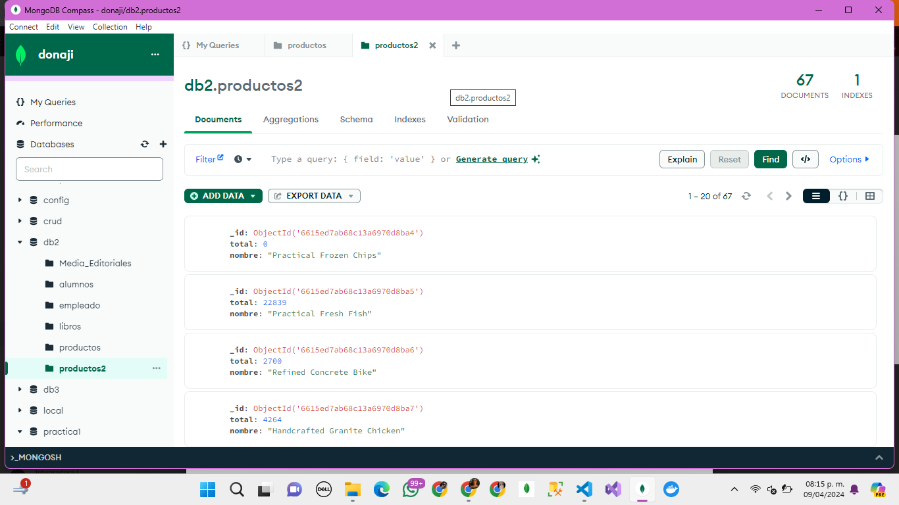

# Ejercicios De Agregaciones ⚡
## ⚡ Vania Donaji Velazquez Torres ⚡
### Consulta 1 ⚡
1. Cuenta los productos de tipo “medio”, usando un método básico
```json
    [
    {
        $match: {
        tipo: "medio",
        },
    },
    {
        $count: "Tipo Medio",
    },
    ]
```
- Resultado de la consulta
```json
    {
    "Tipo Medio": 25
    }
```

### Consulta 2 ⚡
2. Indicar con un distinct, las empresas (fabricantes) que hay en la colección
```json
    [
  {
    $group: {
      _id: 0,
      fabricantes: {
        $addToSet: "$fabricante",
      },
    },
  },
  {
    $project:
      {
        _id: 0,
      },
  },
]
```
- Resultado de la consulta
```json
{
  "fabricantes": [
    "AutoNation",
    "Telephone & Data Systems",
    "A.O. Smith",
    "Motorola Solutions",
    "Pool",
    "First Solar",
    "HealthSouth",
    "Trinity Industries",
    "Nasdaq OMX Group",
    "Comerica",
    "CIT Group",
    "Mercury General",
    "Precision Castparts",
    "American Tire Distributors Holdings",
    "Best Buy",
    "Kar Auction Services",
    "Comcast",
    "Alere",
    "SunPower",
    "Total System Services",
    "Delta Tucker Holdings",
    "Kelly Services",
    "Lennar",
    "Dick's Sporting Goods",
    "Williams-Sonoma",
    "Kemper",
    "Securian Financial Group",
    "Kimberly-Clark",
    "Hawaiian Holdings",
    "Simon Property Group",
    "Core-Mark Holding",
    "Wendy's",
    "Hanesbrands",
    "OneMain Holdings",
    "Cabot",
    "Nordstrom",
    "Hartford Financial Services Group",
    "Werner Enterprises",
    "State Farm Insurance Cos.",
    "State Street Corp.",
    "Anthem",
    "HCA Holdings",
    "Raymond James Financial",
    "Mondelez International",
    "TransDigm Group",
    "TrueBlue",
    "Hyatt Hotels",
    "Archrock",
    "Pep Boys-Mann",
    "National Oilwell Varco",
    "TEGNA",
    "Primoris Services",
    "Darling Ingredients",
    "Seaboard",
    "WestRock",
    "Ascena Retail Group",
    "Tractor Supply",
    "Universal American",
    "Universal Health Services",
    "Oneok",
    "Delta Air Lines",
    "WGL Holdings",
    "Orbital ATK",
    "DST Systems"
  ]
}
```

### Consulta 3 ⚡
3. Usando aggregate, visualizar los productos que tengan más de 80 unidades
```json
[
  {
    $match:
      {
        unidades: {
          $gt: 80,
        },
      },
  },
]
```
- Resultado de la consulta
**dieron 9 resultados**
```json
[
    {
    "_id": {
        "$oid": "6615a57035e29d93506ea8a7"
    },
    "codigo": 0,
    "nombre": "Fantastic Wooden Fish",
    "unidades": 95,
    "precio": 291,
    "fabricante": "Kimberly-Clark",
    "tipo": "avanzado"
    },
    {
    "_id": {
        "$oid": "6615a57035e29d93506ea8a9"
    },
    "codigo": 2,
    "nombre": "Small Soft Fish",
    "unidades": 96,
    "precio": 189,
    "fabricante": "Primoris Services",
    "tipo": "medio"
    },
    {
    "_id": {
        "$oid": "6615a57035e29d93506ea8b3"
    },
    "codigo": 12,
    "nombre": "Refined Concrete Salad",
    "unidades": 90,
    "precio": 129,
    "fabricante": "Universal Health Services",
    "tipo": "avanzado"
    },
    {
    "_id": {
        "$oid": "6615a57035e29d93506ea8c5"
    },
    "codigo": 30,
    "nombre": "Small Rubber Pants",
    "unidades": 89,
    "precio": 16,
    "fabricante": "Hanesbrands",
    "tipo": "basico"
    },
    {
    "_id": {
        "$oid": "6615a57035e29d93506ea8c8"
    },
    "codigo": 33,
    "nombre": "Generic Concrete Hat",
    "unidades": 82,
    "precio": 70,
    "fabricante": "American Tire Distributors Holdings",
    "tipo": "basico"
    },
    {
    "_id": {
        "$oid": "6615a57035e29d93506ea8dc"
    },
    "codigo": 53,
    "nombre": "Licensed Plastic Hat",
    "unidades": 96,
    "precio": 38,
    "fabricante": "Best Buy",
    "tipo": "medio"
    },
    {
    "_id": {
        "$oid": "6615a57035e29d93506ea8dd"
    },
    "codigo": 54,
    "nombre": "Generic Metal Sausages",
    "unidades": 84,
    "precio": 77,
    "fabricante": "DST Systems",
    "tipo": "medio"
    },
    {
    "_id": {
        "$oid": "6615a57035e29d93506ea8e4"
    },
    "codigo": 61,
    "nombre": "Sleek Rubber Keyboard",
    "unidades": 82,
    "precio": 33,
    "fabricante": "Alere",
    "tipo": "basico"
    },
    {
    "_id": {
        "$oid": "6615a57035e29d93506ea8e9"
    },
    "codigo": 66,
    "nombre": "Incredible Concrete Fish",
    "unidades": 96,
    "precio": 336,
    "fabricante": "Darling Ingredients",
    "tipo": "medio"
    }
]
```

### Consulta 4 <span style="color: yellow;">⚡</span>
4. Con $project visualizar solo el nombre, unidades y precio de los productos que tengan menos de 10 unidades
```json
[
  {
    $match:
      {
        unidades: {
          $lt: 10,
        },
      },
  },
  {
    $project:
      {
        _id: 0,
        nombre: 1,
        unidades: 1,
        precio: 1,
      },
  },
]
```
- Resultado de la consulta
**dió como resultado 7 documentos**
```json
[
    {
    "nombre": "Ergonomic Metal Ball",
    "unidades": 5,
    "precio": 246
    },
    {
    "nombre": "Handmade Plastic Hat",
    "unidades": 7,
    "precio": 253
    },
    {
    "nombre": "Ergonomic Metal Table",
    "unidades": 0,
    "precio": 94
    },
    {
    "nombre": "Practical Frozen Chips",
    "unidades": 0,
    "precio": 305
    },
    {
    "nombre": "Fantastic Metal Pants",
    "unidades": 5,
    "precio": 129
    },
    {
    "nombre": "Intelligent Frozen Sausages",
    "unidades": 3,
    "precio": 111
    },
    {
    "nombre": "Rustic Plastic Mouse",
    "unidades": 5,
    "precio": 24
    }
]
```

### Consulta 5 <span style="color: yellow;">⚡</span>
5. Con $project ponemos el fabricante, pero le cambiamos el nombre por “empresa”. Usamos el mismo comando anterior
```json
[
  {
    $match:
      {
        unidades: {
          $lt: 10,
        },
      },
  },
  {
    $project:
      {
        _id: 0,
        nombre: 1,
        unidades: 1,
        precio: 1,
        empresa: "$fabricante",
      },
  },
]
```
- Resultado de la consulta 
**dió 7 documentos de resultado**
```json
[
    {
    "nombre": "Ergonomic Metal Ball",
    "unidades": 5,
    "precio": 246,
    "empresa": "Seaboard"
    },
    {
    "nombre": "Handmade Plastic Hat",
    "unidades": 7,
    "precio": 253,
    "empresa": "Dick's Sporting Goods"
    },
    {
    "nombre": "Ergonomic Metal Table",
    "unidades": 0,
    "precio": 94,
    "empresa": "Kelly Services"
    },
    {
    "nombre": "Practical Frozen Chips",
    "unidades": 0,
    "precio": 305,
    "empresa": "Delta Air Lines"
    },
    {
    "nombre": "Fantastic Metal Pants",
    "unidades": 5,
    "precio": 129,
    "empresa": "OneMain Holdings"
    },
    {
    "nombre": "Intelligent Frozen Sausages",
    "unidades": 3,
    "precio": 111,
    "empresa": "A.O. Smith"
    },
    {
    "nombre": "Rustic Plastic Mouse",
    "unidades": 5,
    "precio": 24,
    "empresa": "Orbital ATK"
    }
]
```

### Consulta 6 <span style="color: yellow;">⚡</span>
6. Añadir a la consulta anterior un campo calculado que se llame total y que multiplique precio por unidades.
```json
[
  {
    $match:
      {
        unidades: {
          $lt: 10,
        },
      },
  },
  {
    $project:
      {
        _id: 0,
        nombre: 1,
        unidades: 1,
        precio: 1,
        empresa: "$fabricante",
      },
  },
  {
    $addFields:
      {
        total: {
          $multiply: ["$precio", "$unidades"],
        },
      },
  },
]
```
- Resultado de la consulta **dió 7 documentos**
```json
[
    {
    "nombre": "Ergonomic Metal Ball",
    "unidades": 5,
    "precio": 246,
    "empresa": "Seaboard",
    "total": 1230
    },
    {
    "nombre": "Handmade Plastic Hat",
    "unidades": 7,
    "precio": 253,
    "empresa": "Dick's Sporting Goods",
    "total": 1771
    },
    {
    "nombre": "Ergonomic Metal Table",
    "unidades": 0,
    "precio": 94,
    "empresa": "Kelly Services",
    "total": 0
    },
    {
    "nombre": "Practical Frozen Chips",
    "unidades": 0,
    "precio": 305,
    "empresa": "Delta Air Lines",
    "total": 0
    },
    {
    "nombre": "Fantastic Metal Pants",
    "unidades": 5,
    "precio": 129,
    "empresa": "OneMain Holdings",
    "total": 645
    },
    {
    "nombre": "Intelligent Frozen Sausages",
    "unidades": 3,
    "precio": 111,
    "empresa": "A.O. Smith",
    "total": 333
    },
    {
    "nombre": "Rustic Plastic Mouse",
    "unidades": 5,
    "precio": 24,
    "empresa": "Orbital ATK",
    "total": 120
    }
]
```

### Consulta 7 <span style="color: yellow;">⚡</span>
7. Hacer que el nombre salga en mayúsculas con el operador $toUpper
```json
[
  {
    $match:
      {
        unidades: {
          $lt: 10,
        },
      },
  },
  {
    $project:
      {
        _id: 0,
        nombre: 1,
        unidades: 1,
        precio: 1,
        empresa: "$fabricante",
      },
  },
  {
    $addFields:
      {
        total: {
          $multiply: ["$precio", "$unidades"],
        },
      },
  },
  {
    $addFields:
      {
        mayusculas: {
          $toUpper: "$nombre",
        },
      },
  },
]
```
- Resultado de la consulta **el resultado fue de 7 documentos**
```json
[    
    {
    "nombre": "Ergonomic Metal Ball",
    "unidades": 5,
    "precio": 246,
    "empresa": "Seaboard",
    "total": 1230,
    "mayusculas": "ERGONOMIC METAL BALL"
    },
    {
    "nombre": "Handmade Plastic Hat",
    "unidades": 7,
    "precio": 253,
    "empresa": "Dick's Sporting Goods",
    "total": 1771,
    "mayusculas": "HANDMADE PLASTIC HAT"
    },
    {
    "nombre": "Ergonomic Metal Table",
    "unidades": 0,
    "precio": 94,
    "empresa": "Kelly Services",
    "total": 0,
    "mayusculas": "ERGONOMIC METAL TABLE"
    },
    {
    "nombre": "Practical Frozen Chips",
    "unidades": 0,
    "precio": 305,
    "empresa": "Delta Air Lines",
    "total": 0,
    "mayusculas": "PRACTICAL FROZEN CHIPS"
    },
    {
    "nombre": "Fantastic Metal Pants",
    "unidades": 5,
    "precio": 129,
    "empresa": "OneMain Holdings",
    "total": 645,
    "mayusculas": "FANTASTIC METAL PANTS"
    },
    {
    "nombre": "Intelligent Frozen Sausages",
    "unidades": 3,
    "precio": 111,
    "empresa": "A.O. Smith",
    "total": 333,
    "mayusculas": "INTELLIGENT FROZEN SAUSAGES"
    },
    {
    "nombre": "Rustic Plastic Mouse",
    "unidades": 5,
    "precio": 24,
    "empresa": "Orbital ATK",
    "total": 120,
    "mayusculas": "RUSTIC PLASTIC MOUSE"
    }
]
```

### Consulta 8 <span style="color: yellow;">⚡</span>
8. Añadir un campo calculado que ponga el nombre del producto y el tipo concatenado con el operador $concat. Le llamamos al campo “completo”
```json
[
  {
    $match:
      {
        unidades: {
          $lt: 10,
        },
      },
  },
  {
    $project:
      {
        _id: 0,
        nombre: 1,
        unidades: 1,
        precio: 1,
        empresa: "$fabricante",
        tipo: "$tipo",
      },
  },
  {
    $addFields:
      {
        total: {
          $multiply: ["$precio", "$unidades"],
        },
      },
  },
  {
    $addFields:
      /**
       * newField: The new field name.
       * expression: The new field expression.
       */
      {
        mayusculas: {
          $toUpper: "$nombre",
        },
      },
  },
  {
    $addFields:
      {
        completo: {
          $concat: [
            "$nombre",
            " de tipo ",
            "$tipo",
          ],
        },
      },
  },
]
```
- Resultado de la consulta. **7 documentos**
```json
[
    {
    "nombre": "Ergonomic Metal Ball",
    "unidades": 5,
    "precio": 246,
    "empresa": "Seaboard",
    "tipo": "medio",
    "total": 1230,
    "mayusculas": "ERGONOMIC METAL BALL",
    "completo": "Ergonomic Metal Ball de tipo medio"
    },
    {
    "nombre": "Handmade Plastic Hat",
    "unidades": 7,
    "precio": 253,
    "empresa": "Dick's Sporting Goods",
    "tipo": "medio",
    "total": 1771,
    "mayusculas": "HANDMADE PLASTIC HAT",
    "completo": "Handmade Plastic Hat de tipo medio"
    },
    {
    "nombre": "Ergonomic Metal Table",
    "unidades": 0,
    "precio": 94,
    "empresa": "Kelly Services",
    "tipo": "avanzado",
    "total": 0,
    "mayusculas": "ERGONOMIC METAL TABLE",
    "completo": "Ergonomic Metal Table de tipo avanzado"
    },
    {
    "nombre": "Practical Frozen Chips",
    "unidades": 0,
    "precio": 305,
    "empresa": "Delta Air Lines",
    "tipo": "medio",
    "total": 0,
    "mayusculas": "PRACTICAL FROZEN CHIPS",
    "completo": "Practical Frozen Chips de tipo medio"
    },
    {
    "nombre": "Fantastic Metal Pants",
    "unidades": 5,
    "precio": 129,
    "empresa": "OneMain Holdings",
    "tipo": "basico",
    "total": 645,
    "mayusculas": "FANTASTIC METAL PANTS",
    "completo": "Fantastic Metal Pants de tipo basico"
    },
    {
    "nombre": "Intelligent Frozen Sausages",
    "unidades": 3,
    "precio": 111,
    "empresa": "A.O. Smith",
    "tipo": "basico",
    "total": 333,
    "mayusculas": "INTELLIGENT FROZEN SAUSAGES",
    "completo": "Intelligent Frozen Sausages de tipo basico"
    },
    {
    "nombre": "Rustic Plastic Mouse",
    "unidades": 5,
    "precio": 24,
    "empresa": "Orbital ATK",
    "tipo": "avanzado",
    "total": 120,
    "mayusculas": "RUSTIC PLASTIC MOUSE",
    "completo": "Rustic Plastic Mouse de tipo avanzado"
    }
]
```

### Consulta 9 <span style="color: yellow;">⚡</span>
9. Ordena el resultado por el campo “total”
```json
[
  {
    $match:
      {
        unidades: {
          $lt: 10,
        },
      },
  },
  {
    $project:
      {
        _id: 0,
        nombre: 1,
        unidades: 1,
        precio: 1,
        empresa: "$fabricante",
        tipo: "$tipo",
      },
  },
  {
    $addFields:
      {
        total: {
          $multiply: ["$precio", "$unidades"],
        },
      },
  },
  {
    $addFields:
      {
        mayusculas: {
          $toUpper: "$nombre",
        },
      },
  },
  {
    $addFields:
      {
        completo: {
          $concat: [
            "$nombre",
            " de tipo ",
            "$tipo",
          ],
        },
      },
  },
  {
    $sort:
      {
        total: 1,
      },
  },
]
```
- Resultado de la consulta
```json
[
    {
    "nombre": "Ergonomic Metal Table",
    "unidades": 0,
    "precio": 94,
    "empresa": "Kelly Services",
    "tipo": "avanzado",
    "total": 0,
    "mayusculas": "ERGONOMIC METAL TABLE",
    "completo": "Ergonomic Metal Table de tipo avanzado"
    },
    {
    "nombre": "Practical Frozen Chips",
    "unidades": 0,
    "precio": 305,
    "empresa": "Delta Air Lines",
    "tipo": "medio",
    "total": 0,
    "mayusculas": "PRACTICAL FROZEN CHIPS",
    "completo": "Practical Frozen Chips de tipo medio"
    },
    {
    "nombre": "Rustic Plastic Mouse",
    "unidades": 5,
    "precio": 24,
    "empresa": "Orbital ATK",
    "tipo": "avanzado",
    "total": 120,
    "mayusculas": "RUSTIC PLASTIC MOUSE",
    "completo": "Rustic Plastic Mouse de tipo avanzado"
    },
    {
    "nombre": "Intelligent Frozen Sausages",
    "unidades": 3,
    "precio": 111,
    "empresa": "A.O. Smith",
    "tipo": "basico",
    "total": 333,
    "mayusculas": "INTELLIGENT FROZEN SAUSAGES",
    "completo": "Intelligent Frozen Sausages de tipo basico"
    },
    {
    "nombre": "Fantastic Metal Pants",
    "unidades": 5,
    "precio": 129,
    "empresa": "OneMain Holdings",
    "tipo": "basico",
    "total": 645,
    "mayusculas": "FANTASTIC METAL PANTS",
    "completo": "Fantastic Metal Pants de tipo basico"
    },
    {
    "nombre": "Ergonomic Metal Ball",
    "unidades": 5,
    "precio": 246,
    "empresa": "Seaboard",
    "tipo": "medio",
    "total": 1230,
    "mayusculas": "ERGONOMIC METAL BALL",
    "completo": "Ergonomic Metal Ball de tipo medio"
    },
    {
    "nombre": "Handmade Plastic Hat",
    "unidades": 7,
    "precio": 253,
    "empresa": "Dick's Sporting Goods",
    "tipo": "medio",
    "total": 1771,
    "mayusculas": "HANDMADE PLASTIC HAT",
    "completo": "Handmade Plastic Hat de tipo medio"
    }
]
```

### Consulta 10 <span style="color: yellow;">⚡</span>
10. Haciendo una nueva consulta, averiguar el numero de productos por tipo de producto
```json
[
  {
    $group:
      {
        _id: "$tipo",
        count: {
          $sum: 1,
        },
      },
  },
]
```
- Resultado de la consulta **dió 3 documentos**
```json
[
    {
    "_id": "medio",
    "count": 25
    },
    {
    "_id": "avanzado",
    "count": 18
    },
    {
    "_id": "basico",
    "count": 24
    }
]
```

### Consulta 11 <span style="color: yellow;">⚡</span>
11. Añadir el valor mayor y el menor
```json
[
  {
    $group:
      {
        _id: "$tipo",
        numero_productos: {
          $sum: 1,
        },
        valor_mayor: {
          $max: "$precio",
        },
        valor_menor: {
          $min: "$precio",
        },
      },
  },
]
```
- Resultado de la consulta **3 documentos**
```json
[
    {
    "_id": "medio",
    "numero_productos": 25,
    "valor_mayor": 337,
    "valor_menor": 16
    },
    {
    "_id": "basico",
    "numero_productos": 24,
    "valor_mayor": 285,
    "valor_menor": 16
    },
    {
    "_id": "avanzado",
    "numero_productos": 18,
    "valor_mayor": 331,
    "valor_menor": 18
    }
]
```

### Consulta 12 <span style="color: yellow;">⚡</span>
12. Añade el total de unidades por cada tipo
```json
[
  {
    $group:
      {
        _id: "$tipo",
        numero_productos: {
          $sum: 1,
        },
        valor_mayor: {
          $max: "$precio",
        },
        valor_menor: {
          $min: "$precio",
        },
        total_unidades: {
          $sum: "$unidades",
        },
      },
  },
]
```
- Resultado de la consulta **dió 3 documentos como resultado**
```json
[
    {
    "_id": "medio",
    "numero_productos": 25,
    "valor_mayor": 337,
    "valor_menor": 16,
    "total_unidades": 1224
    },
    {
    "_id": "avanzado",
    "numero_productos": 18,
    "valor_mayor": 331,
    "valor_menor": 18,
    "total_unidades": 773
    },
    {
    "_id": "basico",
    "numero_productos": 24,
    "valor_mayor": 285,
    "valor_menor": 16,
    "total_unidades": 1067
    }
]
```

### Consulta 13 <span style="color: yellow;">⚡</span>
13. Con el operador $set y el operador “$substr” visualiza todos los datos del producto "Small Metal Tuna" y los primeros 5 caracteres del nombre
```json
[
  {
    $match:
      {
        nombre: "Small Metal Tuna",
      },
  },
  {
    $set:
      {
        nombre_5_caracteres: {
          $substr: ["$nombre", 0, 5],
        },
      },
  },
]
```
- Resultado de la consulta
```json
{
  "_id": {
    "$oid": "6615a57035e29d93506ea8de"
  },
  "codigo": 55,
  "nombre": "Small Metal Tuna",
  "unidades": 46,
  "precio": 43,
  "fabricante": "Raymond James Financial",
  "tipo": "medio",
  "nombre_5_caracteres": "Small"
}
```

### Consulta 14 <span style="color: yellow;">⚡</span>
14. Creamos una salida que tenga el nombre del articulo y el total (precio por unidades) y lo guardamos en una colección denominada productos2
```json
[
  {
    "$group": {
      "_id": "$nombre",
      "total": { "$sum": { "$multiply": ["$precio", "$unidades"] } }
    }
  },
  {
    "$project": {
      "_id": 0,
      "nombre": "$_id",
      "total": 1
    }
  },
  {
    "$out": "productos2"
  }
]
```
- Resultado de la consulta

**Esta consulta fue en la colección de: _productos2_**
```json
[
    {
    "_id": {
        "$oid": "6615ed7ab68c13a6970d8ba4"
    },
    "total": 0,
    "nombre": "Practical Frozen Chips"
    },
    {
    "_id": {
        "$oid": "6615ed7ab68c13a6970d8ba5"
    },
    "total": 22839,
    "nombre": "Practical Fresh Fish"
    },
    {
    "_id": {
        "$oid": "6615ed7ab68c13a6970d8ba6"
    },
    "total": 2700,
    "nombre": "Refined Concrete Bike"
    },
    {
    "_id": {
        "$oid": "6615ed7ab68c13a6970d8ba7"
    },
    "total": 4264,
    "nombre": "Handcrafted Granite Chicken"
    },
    {
    "_id": {
        "$oid": "6615ed7ab68c13a6970d8ba8"
    },
    "total": 645,
    "nombre": "Fantastic Metal Pants"
    },
    {
    "_id": {
        "$oid": "6615ed7ab68c13a6970d8ba9"
    },
    "total": 20590,
    "nombre": "Incredible Granite Gloves"
    },
    {
    "_id": {
        "$oid": "6615ed7ab68c13a6970d8baa"
    },
    "total": 20160,
    "nombre": "Handcrafted Metal Tuna"
    },
    {
    "_id": {
        "$oid": "6615ed7ab68c13a6970d8bab"
    },
    "total": 2256,
    "nombre": "Intelligent Metal Bike"
    },
    {
    "_id": {
        "$oid": "6615ed7ab68c13a6970d8bac"
    },
    "total": 6468,
    "nombre": "Generic Metal Sausages"
    },
    {
    "_id": {
        "$oid": "6615ed7ab68c13a6970d8bad"
    },
    "total": 8480,
    "nombre": "Refined Wooden Tuna"
    },
    {
    "_id": {
        "$oid": "6615ed7ab68c13a6970d8bae"
    },
    "total": 10023,
    "nombre": "Rustic Steel Shoes"
    },
    {
    "_id": {
        "$oid": "6615ed7ab68c13a6970d8baf"
    },
    "total": 2125,
    "nombre": "Ergonomic Metal Hat"
    },
    {
    "_id": {
        "$oid": "6615ed7ab68c13a6970d8bb0"
    },
    "total": 8208,
    "nombre": "Handcrafted Granite Cheese"
    },
    {
    "_id": {
        "$oid": "6615ed7ab68c13a6970d8bb1"
    },
    "total": 1104,
    "nombre": "Generic Fresh Keyboard"
    },
    {
    "_id": {
        "$oid": "6615ed7ab68c13a6970d8bb2"
    },
    "total": 24163,
    "nombre": "Rustic Soft Table"
    },
    {
    "_id": {
        "$oid": "6615ed7ab68c13a6970d8bb3"
    },
    "total": 0,
    "nombre": "Ergonomic Metal Table"
    },
    {
    "_id": {
        "$oid": "6615ed7ab68c13a6970d8bb4"
    },
    "total": 2747,
    "nombre": "Practical Soft Pants"
    },
    {
    "_id": {
        "$oid": "6615ed7ab68c13a6970d8bb5"
    },
    "total": 15145,
    "nombre": "Licensed Fresh Chicken"
    },
    {
    "_id": {
        "$oid": "6615ed7ab68c13a6970d8bb6"
    },
    "total": 4400,
    "nombre": "Sleek Frozen Hat"
    },
    {
    "_id": {
        "$oid": "6615ed7ab68c13a6970d8bb7"
    },
    "total": 940,
    "nombre": "Ergonomic Steel Fish"
    }
]
```

### Consulta 15 <span style="color: yellow;">⚡</span>
15. Creamos una salida que tenga el nombre del articulo y el total (precio por unidades) y lo guardamos en una colección denominada productos2
#### ES LO MISMO QUE LA CONSULTA 14
```json
[
  {
    "$group": {
      "_id": "$nombre",
      "total": { "$sum": { "$multiply": ["$precio", "$unidades"] } }
    }
  },
  {
    "$project": {
      "_id": 0,
      "nombre": "$_id",
      "total": 1
    }
  },
  {
    "$out": "productos2"
  }
]
```
- Resultado de la consulta

**Esta consulta fue en la colección de: _productos2_**
```json
[
    {
    "_id": {
        "$oid": "6615ed7ab68c13a6970d8ba4"
    },
    "total": 0,
    "nombre": "Practical Frozen Chips"
    },
    {
    "_id": {
        "$oid": "6615ed7ab68c13a6970d8ba5"
    },
    "total": 22839,
    "nombre": "Practical Fresh Fish"
    },
    {
    "_id": {
        "$oid": "6615ed7ab68c13a6970d8ba6"
    },
    "total": 2700,
    "nombre": "Refined Concrete Bike"
    },
    {
    "_id": {
        "$oid": "6615ed7ab68c13a6970d8ba7"
    },
    "total": 4264,
    "nombre": "Handcrafted Granite Chicken"
    },
    {
    "_id": {
        "$oid": "6615ed7ab68c13a6970d8ba8"
    },
    "total": 645,
    "nombre": "Fantastic Metal Pants"
    },
    {
    "_id": {
        "$oid": "6615ed7ab68c13a6970d8ba9"
    },
    "total": 20590,
    "nombre": "Incredible Granite Gloves"
    },
    {
    "_id": {
        "$oid": "6615ed7ab68c13a6970d8baa"
    },
    "total": 20160,
    "nombre": "Handcrafted Metal Tuna"
    },
    {
    "_id": {
        "$oid": "6615ed7ab68c13a6970d8bab"
    },
    "total": 2256,
    "nombre": "Intelligent Metal Bike"
    },
    {
    "_id": {
        "$oid": "6615ed7ab68c13a6970d8bac"
    },
    "total": 6468,
    "nombre": "Generic Metal Sausages"
    },
    {
    "_id": {
        "$oid": "6615ed7ab68c13a6970d8bad"
    },
    "total": 8480,
    "nombre": "Refined Wooden Tuna"
    },
    {
    "_id": {
        "$oid": "6615ed7ab68c13a6970d8bae"
    },
    "total": 10023,
    "nombre": "Rustic Steel Shoes"
    },
    {
    "_id": {
        "$oid": "6615ed7ab68c13a6970d8baf"
    },
    "total": 2125,
    "nombre": "Ergonomic Metal Hat"
    },
    {
    "_id": {
        "$oid": "6615ed7ab68c13a6970d8bb0"
    },
    "total": 8208,
    "nombre": "Handcrafted Granite Cheese"
    },
    {
    "_id": {
        "$oid": "6615ed7ab68c13a6970d8bb1"
    },
    "total": 1104,
    "nombre": "Generic Fresh Keyboard"
    },
    {
    "_id": {
        "$oid": "6615ed7ab68c13a6970d8bb2"
    },
    "total": 24163,
    "nombre": "Rustic Soft Table"
    },
    {
    "_id": {
        "$oid": "6615ed7ab68c13a6970d8bb3"
    },
    "total": 0,
    "nombre": "Ergonomic Metal Table"
    },
    {
    "_id": {
        "$oid": "6615ed7ab68c13a6970d8bb4"
    },
    "total": 2747,
    "nombre": "Practical Soft Pants"
    },
    {
    "_id": {
        "$oid": "6615ed7ab68c13a6970d8bb5"
    },
    "total": 15145,
    "nombre": "Licensed Fresh Chicken"
    },
    {
    "_id": {
        "$oid": "6615ed7ab68c13a6970d8bb6"
    },
    "total": 4400,
    "nombre": "Sleek Frozen Hat"
    },
    {
    "_id": {
        "$oid": "6615ed7ab68c13a6970d8bb7"
    },
    "total": 940,
    "nombre": "Ergonomic Steel Fish"
    }
]
```

### Consulta 16 <span style="color: yellow;">⚡</span>
16. Comprobamos que se ha creado


### Consulta 17 <span style="color: yellow;">⚡</span>
17. Hacemos un find para comprobar el resultado
```json
    db.productos2.find({})
```
- Resultado de la consulta
```json
    [
  {
    _id: ObjectId('6615ed7ab68c13a6970d8ba4'),
    total: 0,
    nombre: 'Practical Frozen Chips'
  },
  {
    _id: ObjectId('6615ed7ab68c13a6970d8ba5'),
    total: 22839,
    nombre: 'Practical Fresh Fish'
  },
  {
    _id: ObjectId('6615ed7ab68c13a6970d8ba6'),
    total: 2700,
    nombre: 'Refined Concrete Bike'
  },
  {
    _id: ObjectId('6615ed7ab68c13a6970d8ba7'),
    total: 4264,
    nombre: 'Handcrafted Granite Chicken'
  },
  {
    _id: ObjectId('6615ed7ab68c13a6970d8ba8'),
    total: 645,
    nombre: 'Fantastic Metal Pants'
  },
  {
    _id: ObjectId('6615ed7ab68c13a6970d8ba9'),
    total: 20590,
    nombre: 'Incredible Granite Gloves'
  },
  {
    _id: ObjectId('6615ed7ab68c13a6970d8baa'),
    total: 20160,
    nombre: 'Handcrafted Metal Tuna'
  },
  {
    _id: ObjectId('6615ed7ab68c13a6970d8bab'),
    total: 2256,
    nombre: 'Intelligent Metal Bike'
  },
  {
    _id: ObjectId('6615ed7ab68c13a6970d8bac'),
    total: 6468,
    nombre: 'Generic Metal Sausages'
  },
  {
    _id: ObjectId('6615ed7ab68c13a6970d8bad'),
    total: 8480,
    nombre: 'Refined Wooden Tuna'
  },
  {
    _id: ObjectId('6615ed7ab68c13a6970d8bae'),
    total: 10023,
    nombre: 'Rustic Steel Shoes'
  },
  {
    _id: ObjectId('6615ed7ab68c13a6970d8baf'),
    total: 2125,
    nombre: 'Ergonomic Metal Hat'
  },
  {
    _id: ObjectId('6615ed7ab68c13a6970d8bb0'),
    total: 8208,
    nombre: 'Handcrafted Granite Cheese'
  },
  {
    _id: ObjectId('6615ed7ab68c13a6970d8bb1'),
    total: 1104,
    nombre: 'Generic Fresh Keyboard'
  },
  {
    _id: ObjectId('6615ed7ab68c13a6970d8bb2'),
    total: 24163,
    nombre: 'Rustic Soft Table'
  },
  {
    _id: ObjectId('6615ed7ab68c13a6970d8bb3'),
    total: 0,
    nombre: 'Ergonomic Metal Table'
  },
  {
    _id: ObjectId('6615ed7ab68c13a6970d8bb4'),
    total: 2747,
    nombre: 'Practical Soft Pants'
  },
  {
    _id: ObjectId('6615ed7ab68c13a6970d8bb5'),
    total: 15145,
    nombre: 'Licensed Fresh Chicken'
  },
  {
    _id: ObjectId('6615ed7ab68c13a6970d8bb6'),
    total: 4400,
    nombre: 'Sleek Frozen Hat'
  },
  {
    _id: ObjectId('6615ed7ab68c13a6970d8bb7'),
    total: 940,
    nombre: 'Ergonomic Steel Fish'
  }
]
```
# LISTO :) <span style="color: yellow;">⚡</span>

