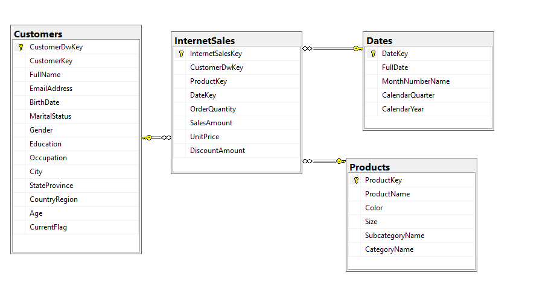

# Operaciones en el script SQL⚡
# ⚡Vania Donaji Velazquez Torres⚡
## Eliminar base de datos si existe
```sql
USE master;
IF DB_ID('TK463DW') IS NOT NULL
DROP DATABASE TK463DW;
```
Si la base de datos `TK463DW` existe, esta operación la elimina para preparar el terreno para su recreación.

## Crear base de datos
```sql
CREATE DATABASE TK463DW
ON PRIMARY
(NAME = N'TK463DW', FILENAME = N'C:\TK463\TK463DW.mdf',
SIZE = 307200KB , FILEGROWTH = 10240KB )
LOG ON
(NAME = N'TK463DW_log', FILENAME = N'C:\TK463\TK463DW_log.ldf',
SIZE = 51200KB , FILEGROWTH = 10%);
```
Crea una nueva base de datos llamada `TK463DW` con un archivo de datos y un archivo de registro. Establece tamaños iniciales y configuraciones de crecimiento para ambos archivos.

## Cambiar el modelo de recuperación de la base de datos
```sql
ALTER DATABASE TK463DW SET RECOVERY SIMPLE WITH NO_WAIT;
```
Establece el modelo de recuperación de la base de datos en "Simple", lo que significa que SQL Server no mantiene registros de transacciones para la recuperación en caso de un fallo del sistema.

## Cambiar al contexto de la nueva base de datos
```sql
USE TK463DW;
```
Cambia al contexto de la base de datos recién creada `TK463DW` para realizar operaciones dentro de ella.

## Crear una secuencia
```sql
IF OBJECT_ID('dbo.SeqCustomerDwKey','SO') IS NOT NULL
DROP SEQUENCE dbo.SeqCustomerDwKey;

CREATE SEQUENCE dbo.SeqCustomerDwKey AS INT
START WITH 1
INCREMENT BY 1;
```
Elimina la secuencia `SeqCustomerDwKey` si existe y luego crea una nueva secuencia con el mismo nombre para generar valores para la columna `CustomerDwKey`.

## Crear tablas
```sql
--Crear la tabla Customers
CREATE TABLE dbo.Customers
(
CustomerDwKey INT NOT NULL,
CustomerKey INT NOT NULL,
FullName NVARCHAR(150) NULL,
EmailAddress NVARCHAR(50) NULL,
BirthDate DATE NULL,
MaritalStatus NCHAR(1) NULL,
Gender NCHAR(1) NULL,
Education NVARCHAR(40) NULL,
Occupation NVARCHAR(100) NULL,
City NVARCHAR(30) NULL,
StateProvince NVARCHAR(50) NULL,
CountryRegion NVARCHAR(50) NULL,
Age AS
CASE
WHEN DATEDIFF(yy, BirthDate, CURRENT_TIMESTAMP) <= 40
THEN 'Younger'
WHEN DATEDIFF(yy, BirthDate, CURRENT_TIMESTAMP) > 50
THEN 'Older'
ELSE 'Middle Age'
END,
CurrentFlag BIT NOT NULL DEFAULT 1,
CONSTRAINT PK_Customers PRIMARY KEY (CustomerDwKey)
);
GO

-- Crear la tabla Products
CREATE TABLE dbo.Products
(
ProductKey INT NOT NULL,
ProductName NVARCHAR(50) NULL,
Color NVARCHAR(15) NULL,
Size NVARCHAR(50) NULL,
SubcategoryName NVARCHAR(50) NULL,
CategoryName NVARCHAR(50) NULL,
CONSTRAINT PK_Products PRIMARY KEY (ProductKey)
);
GO

-- Crearv la tabla de Dates
CREATE TABLE dbo.Dates
(
DateKey INT NOT NULL,
FullDate DATE NOT NULL,
MonthNumberName NVARCHAR(15) NULL,
CalendarQuarter TINYINT NULL,
CalendarYear SMALLINT NULL,
CONSTRAINT PK_Dates PRIMARY KEY (DateKey)
);
GO


-- Crear la tabla InternetSales
CREATE TABLE dbo.InternetSales
(
InternetSalesKey INT NOT NULL IDENTITY(1,1),
CustomerDwKey INT NOT NULL,
ProductKey INT NOT NULL,
DateKey INT NOT NULL,
OrderQuantity SMALLINT NOT NULL DEFAULT 0,
SalesAmount MONEY NOT NULL DEFAULT 0,
UnitPrice MONEY NOT NULL DEFAULT 0,
DiscountAmount FLOAT NOT NULL DEFAULT 0,
CONSTRAINT PK_InternetSales
PRIMARY KEY (InternetSalesKey)
);
GO
```
Crea las tablas `Customers`, `Products`, `Dates` e `InternetSales` junto con sus columnas y restricciones de clave primaria.

## Agregar restricciones de clave externa
```sql
ALTER TABLE dbo.InternetSales ADD CONSTRAINT
FK_InternetSales_Customers1 FOREIGN KEY(CustomerDwKey)
REFERENCES dbo.Customers (CustomerDwKey);

ALTER TABLE dbo.InternetSales ADD CONSTRAINT
FK_InternetSales_Products FOREIGN KEY(ProductKey)
REFERENCES dbo.Products (ProductKey);

ALTER TABLE dbo.InternetSales ADD CONSTRAINT
FK_InternetSales_Dates3 FOREIGN KEY(DateKey)
REFERENCES dbo.Dates (DateKey);
```
Agrega restricciones de clave externa a la tabla `InternetSales` para establecer relaciones con las tablas `Customers`, `Products` y `Dates` respectivamente.

## Diagrama de la Base de Datos y Relaciones de las Tablas


# ⚡⚡⚡ LISTO:) ⚡⚡⚡